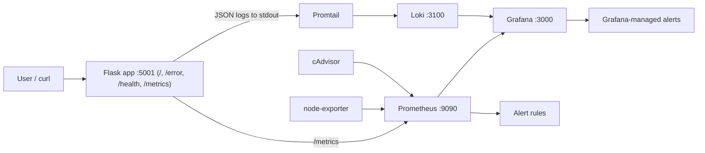
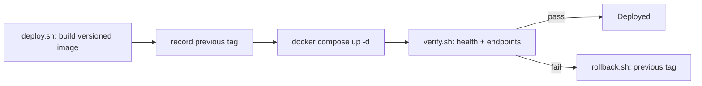
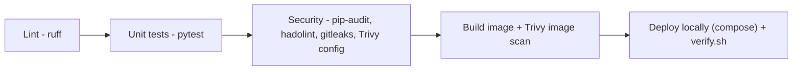
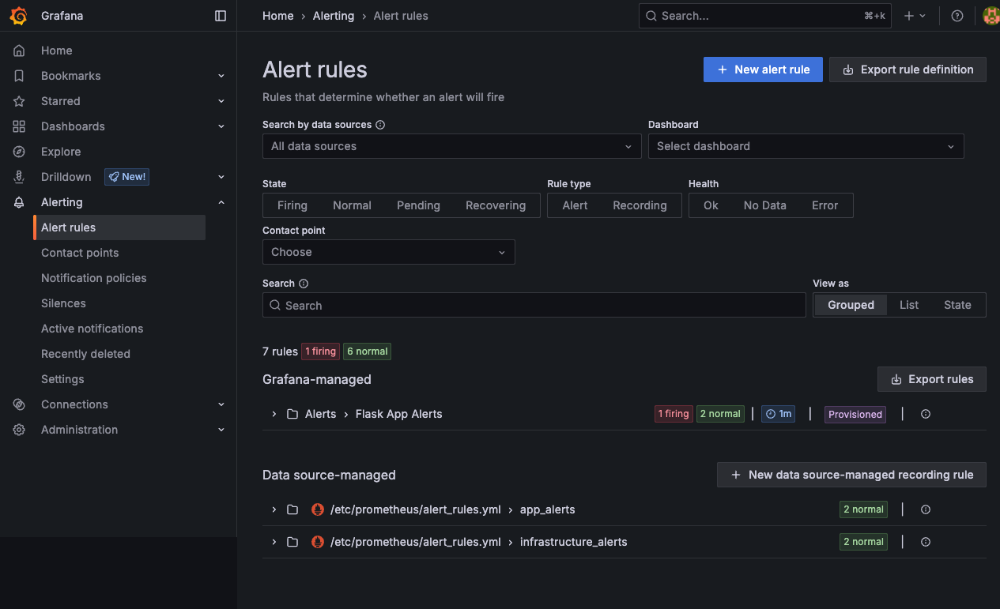
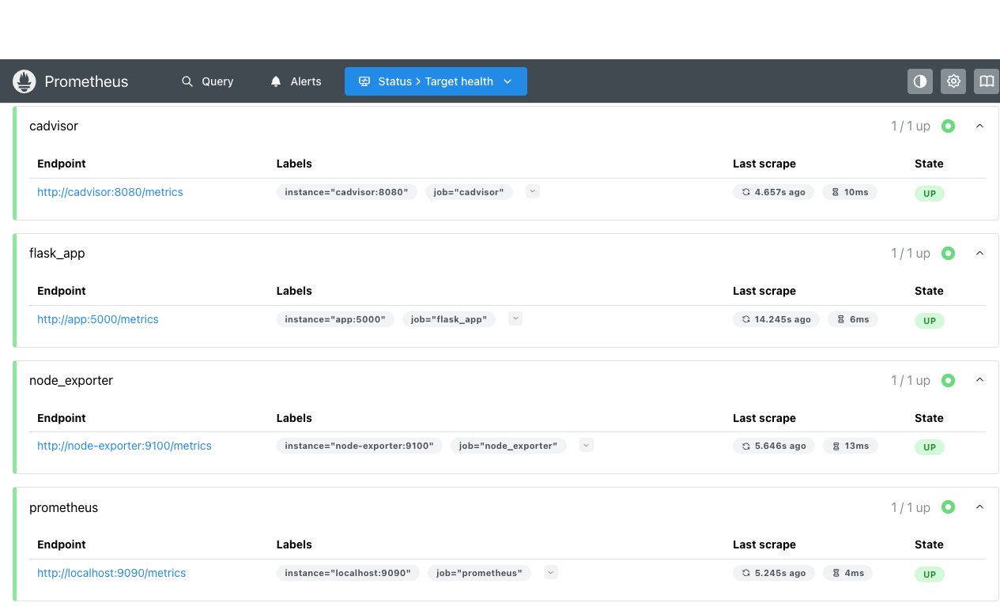

# DevOps Final Project - Production-Ready Observability Stack

A Flask application instrumented for full observability (metrics, logs, alerts)
and wrapped in a complete DevOps workflow: one-command environment automation,
security scanning, CI/CD, health checks, and documented reliability procedures.
Everything runs locally with Docker Compose and free/open-source tools.

## Table of Contents

- [Architecture](#architecture)
- [Quick Start (single command)](#quick-start-single-command)
- [Environment Setup](#environment-setup)
- [Deployment Workflow](#deployment-workflow)
- [Security Implementation](#security-implementation)
- [Monitoring, Logging & Observability](#monitoring-logging--observability)
- [Alerting](#alerting)
- [Reliability Improvements](#reliability-improvements)
- [CI/CD Pipeline](#cicd-pipeline)
- [Branching Strategy](#branching-strategy)
- [Make Targets](#make-targets)
- [Screenshots](#screenshots)

## Architecture



| Service | Port | Role |
| --- | --- | --- |
| Flask app | 5001 -> 5000 | Application under observation (gunicorn, non-root) |
| Prometheus | 9090 | Metrics collection + alert evaluation |
| Grafana | 3000 | Dashboards + alerting UI |
| Loki | 3100 | Log aggregation |
| Promtail | - | Ships container logs to Loki |
| node-exporter | - | Host/runtime metrics |
| cAdvisor | - | Per-container metrics |

The Flask app emits Prometheus metrics (`app_requests_total`,
`app_errors_total`, `app_request_latency_seconds`) and structured JSON logs to
stdout. Prometheus scrapes the app plus infrastructure exporters; Promtail tails
container logs into Loki. Grafana visualizes both and hosts the alert rules.

## Quick Start (single command)

Requirements: Docker + Docker Compose. Then:

```bash
make setup
```

This creates `.env` from the template, builds the image, starts the whole
stack, and waits until every service reports healthy. When it finishes:

- Grafana: <http://localhost:3000> (login `admin` / value of `GF_SECURITY_ADMIN_PASSWORD`)
- Prometheus: <http://localhost:9090>
- App: <http://localhost:5001> (`/`, `/error`, `/health`, `/metrics`)

Tear down with `make down` (keep data) or `make clean` (remove volumes).

## Environment Setup

The project is reproducible on any machine with Docker; no manual configuration
is required beyond an optional password change.

1. `cp .env.example .env` (done automatically by `make setup`).
2. Adjust `.env` if desired:

```env
GF_SECURITY_ADMIN_PASSWORD=change-me-please
APP_PORT=5001
APP_IMAGE=devops-final-app
APP_TAG=latest
```

3. `make up`.

`.env` is git-ignored so real secrets never enter version control; the compose
file fails fast if `GF_SECURITY_ADMIN_PASSWORD` is unset.

## Deployment Workflow

Deployment is automated and self-verifying via scripts in `scripts/`:



- `make deploy` - builds a versioned image (git SHA), records the previous tag
  for rollback, deploys, and runs post-deploy verification.
- `make verify` - deployment verification: polls `/health` and `/metrics` and
  confirms every container healthcheck passes; exits non-zero on failure.
- `make rollback` - redeploys the previously recorded image tag and re-verifies.

The same flow runs in CI (see [CI/CD Pipeline](#cicd-pipeline)) where the stack
is brought up on the runner and `verify.sh` gates the build.

## Security Implementation

Security checks run both locally (`make scan`) and in CI. All tools are free/OSS.

| Concern | Tool | Where |
| --- | --- | --- |
| Dependency vulnerabilities | `pip-audit` | `make scan`, CI |
| Container image CVEs | Trivy (`image`) | `make scan`, CI |
| IaC / config / Dockerfile | Trivy (`config`) + hadolint | `make scan`, CI |
| Secrets scanning | gitleaks (`.gitleaks.toml`) | `make scan`, CI |
| Dependency updates | Dependabot | GitHub |

Additional hardening:

- Secrets kept out of git via `.env` (git-ignored) + `.env.example` template.
- App container runs as a **non-root** user with a minimal image and a
  `HEALTHCHECK`.
- `scripts/scan.sh` mirrors the CI security suite for local pre-push checks.

## Monitoring, Logging & Observability

**Metrics (Prometheus).** The app exposes request, error, and latency metrics.
Infrastructure is covered by `node-exporter` (host/runtime) and `cAdvisor`
(per-container CPU/memory). All four scrape targets are visible on the
Prometheus targets page.

**Logging (Loki + Promtail).** The app writes one JSON log line per request
(`timestamp`, `level`, `endpoint`, `status`). Promtail tails the container via
the Docker socket, parses JSON fields into labels, and pushes to Loki so logs
can be filtered by `level` or `endpoint` in Grafana.

**Dashboards (Grafana).** The pre-provisioned "Flask App Observability"
dashboard shows requests/min, errors/min, and a live log panel. Datasources
(Prometheus + Loki) and the dashboard are provisioned as code under
`grafana/provisioning/`.

**Health checks.** Every service defines a Docker `healthcheck`, and the app
exposes a dedicated `/health` endpoint.

## Alerting

Alerts are defined in two complementary places:

- Prometheus rules ([prometheus/alert_rules.yml](prometheus/alert_rules.yml)) -
  evaluated by Prometheus.
- Grafana-managed, provisioned rules
  ([grafana/provisioning/alerting/alert_rules.yml](grafana/provisioning/alerting/alert_rules.yml)) -
  visible in the Grafana Alerting UI.

| Alert | Condition | Severity |
| --- | --- | --- |
| `HighErrorRate` | `rate(app_errors_total[1m]) > 5` | critical |
| `HighRequestLatency` | p95 latency > 500ms for 2m | warning |
| `InstanceDown` | a scrape target `up == 0` | critical |
| `ContainerHighMemory` | container memory > 1GB | warning |

Trigger the error-rate alert for a demo:

```bash
for i in $(seq 1 20); do curl -s http://localhost:5001/error > /dev/null; done
```

## Reliability Improvements

- **Health monitoring** - per-service Docker healthchecks + `/health` endpoint;
  `depends_on: condition: service_healthy` enforces correct startup ordering.
- **Failure recovery** - `restart: unless-stopped` on all services.
- **Rollback** - `make rollback` restores the previous image tag (recorded by
  `deploy.sh`) and re-verifies.
- **Deployment verification** - `make verify` provides automated post-deploy
  health/endpoint checks.
- **Service level objectives** - defined in [docs/SLO.md](docs/SLO.md)
  (availability, latency, error budget).
- **Incident response** - runbook in
  [docs/INCIDENT_RESPONSE.md](docs/INCIDENT_RESPONSE.md).

## CI/CD Pipeline

Defined in [.github/workflows/ci.yml](.github/workflows/ci.yml), triggered on
push/PR to `main`/`develop`:



Every stage must pass before merge. The `deploy-verify` job stands up the full
stack on the runner and runs the same verification script used locally,
providing end-to-end deployment verification in CI.

## Branching Strategy

Trunk-based workflow with short-lived `feature/*` branches merged into a
protected `main` via PRs gated by CI. Full details and recommended branch
protection settings in [docs/BRANCHING.md](docs/BRANCHING.md).

## Make Targets

```text
make setup     Bootstrap .env + build + start + verify (one command)
make up        Build and start the stack
make down      Stop the stack
make restart   Rebuild and restart
make logs      Follow logs
make ps        Container status
make test      Run unit tests
make lint      Lint app code (ruff)
make scan      Run the local security scan suite
make verify    Post-deploy health verification
make deploy    Versioned build + deploy + verify
make rollback  Roll back to the previous image tag
make clean     Stop and remove volumes (destroys data)
```

## Screenshots

### Grafana Dashboard (requests, errors, logs)


### Alerting (Prometheus + Grafana-managed rules)



### Prometheus Targets (app + infra monitoring)



### Log Analysis (Loki)


