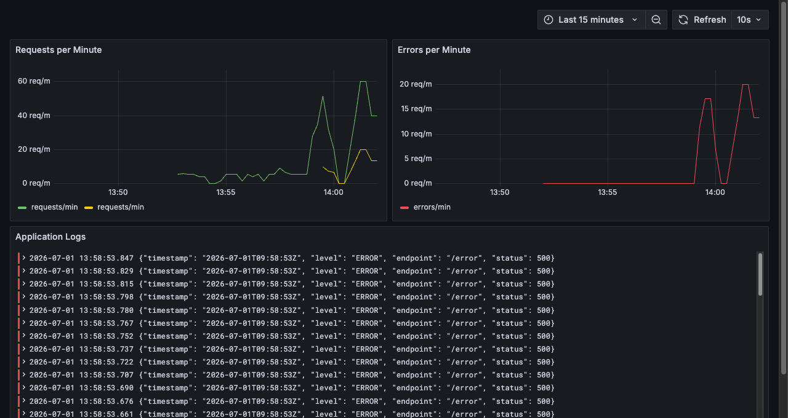
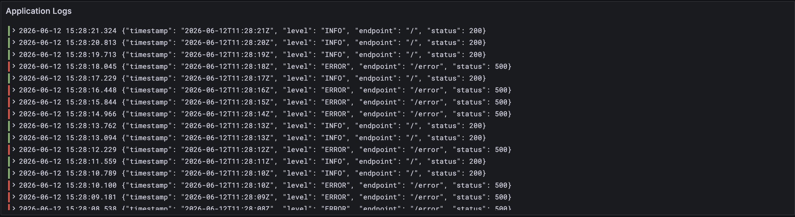
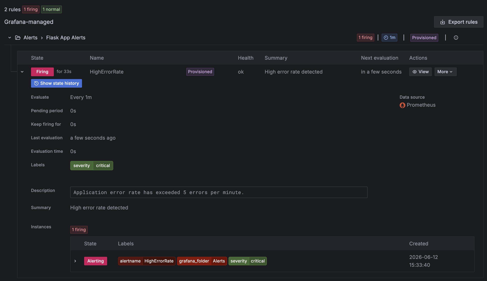

# DevOps Observability Lab

## Architecture

```
Flask App (:5000)
    |
    |-- /metrics --> Prometheus (:9090) --> Grafana (:3000)
    |
    |-- stdout (JSON logs) --> Promtail --> Loki (:3100) --> Grafana (:3000)
```

The Flask app produces two types of telemetry: metrics scraped by Prometheus and JSON logs collected by Promtail and forwarded to Loki. Grafana connects to both as datasources and displays everything in one dashboard.

## Logging Strategy

The app writes structured JSON logs to stdout on every request. Each log line includes a timestamp, log level, endpoint, and HTTP status code. Promtail tails the container logs via the Docker socket, parses the JSON fields into Loki labels, and pushes them to Loki. This makes it easy to filter logs by level or endpoint directly in Grafana.

## How to Run

```bash
docker compose up --build
```

Then open Grafana at <http://localhost:3000> (login: admin / admin).

## How to Trigger the CRITICAL Alert

Run this in a terminal to fire more than 5 errors per minute:

```bash
for i in $(seq 1 20); do curl -s http://localhost:5001/error > /dev/null; done
```

The `HighErrorRate` alert will become active within a minute. You can check it under Alerting > Alert rules in Grafana.

## Screenshots

### Grafana Dashboard



### Log Analysis



### Alert Rule



## Analysis

**Why is JSON-structured logging more efficient than plain text?**

Plain text logs are written for humans to read, which makes them hard to parse automatically. JSON logs have a consistent structure, so log aggregation tools like Loki can extract fields without custom parsing rules. This means you can filter by `level="ERROR"` or `endpoint="/error"` instantly, without writing regex patterns.

**What is the fundamental difference between Prometheus and Loki?**

Prometheus is a metrics system. It stores numeric time-series data and is designed for aggregation and alerting on numbers. Loki is a log aggregation system. It stores raw log lines indexed only by labels, not by content, which keeps storage costs low. They answer different questions: Prometheus tells you how many errors happened, Loki tells you what those errors looked like.

**How would you handle long-term log retention without depleting disk resources?**

A few approaches work well together. First, configure a retention period in Loki (for example 30 days on local disk) so old chunks are deleted automatically. Second, for logs that need to be kept longer, ship them to object storage like S3, which is far cheaper than block storage. Third, use log sampling or filtering to avoid storing low-value debug logs at all. This way the hot storage stays small and the cold storage in object storage handles the long tail.
