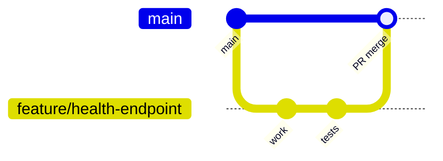

# Branching Strategy

This project uses a lightweight, trunk-based workflow suited to a small team and
continuous delivery.

## Branches

| Branch | Purpose | Protected |
| --- | --- | --- |
| `main` | Always-deployable trunk. Every commit is expected to pass CI. | Yes |
| `develop` (optional) | Integration branch when batching several features. | No |
| `feature/*` | Short-lived branches for a single change. | No |
| `fix/*` | Bug fixes. | No |
| `chore/*` | Tooling, docs, dependency bumps. | No |

## Workflow



1. Branch off `main`: `git switch -c feature/<short-name>`.
2. Commit small, focused changes with conventional messages
   (`feat:`, `fix:`, `chore:`, `docs:`).
3. Open a Pull Request into `main`.
4. CI (`.github/workflows/ci.yml`) runs automatically: lint -> test ->
   security scans -> build -> deploy-verify.
5. Merge only when CI is green. Prefer squash merges to keep history linear.

## Branch protection (recommended GitHub settings for `main`)

- Require a pull request before merging.
- Require the CI status checks (`Lint`, `Unit tests`, `Security scans`,
  `Build image`, `Deploy (local) + verify`) to pass.
- Require branches to be up to date before merging.
- Disallow force pushes and deletions.

## Commit message convention

```
<type>: <summary in imperative mood>

<optional body explaining the why>
```

Types: `feat`, `fix`, `chore`, `docs`, `refactor`, `test`, `ci`.
